# Browser screenshot benchmark and PDF comparison

Use PDF crops for these six plain micro cases; use the scripted browser when the editor view matters. The five painted copies took **1.11 s/view on first load and 1.13 s/view warm**, including navigation and setup. All 48 painted views and 12 micro views passed in the final run.

Measured locally on 4–5 September 2026 with Chrome 152.0.7977.76 and Playwright 1.62.0. Evidence: [final command log](shots-benchmark/20260904-final/runs.json), [initial trial log](shots-benchmark/20260904/runs.json), [capture script](../bin/gdt-shot-headless), and [repeatable benchmark](benchmark-shots.py). These are measurements from one local run, not a latency guarantee.

## First load and warm capture

Each first-load run clears the dedicated Chrome profile’s HTTP cache, opens a new tab, and captures the whole document. The warm run immediately repeats the same URL in another new tab. Cookies, the browser process, and Google service workers remain warm; this is not a fresh-profile or full-machine cold start. Both passes use the same 1440×828 CSS viewport and scroll offsets. One pass per condition per document; there is no statistically supported warm-cache speedup.

Times below include the `uv` executable, CDP connection, navigation, account check, panel/zoom setup, scrolling, JPEG encoding and filing. Metadata/API checks are outside that timer. The window stays off-screen; Chrome is not headless.

| Painted copy | Views/pass | First total (s) | Warm total (s) | First s/view | Warm s/view |
|---|---:|---:|---:|---:|---:|
| [collab](shots-benchmark/20260904-final/painted/collab/first/capture.json) | 4 | 5.07 | 5.08 | 1.27 | 1.27 |
| [kitchen-sink](shots-benchmark/20260904-final/painted/kitchen-sink/first/capture.json) | 4 | 4.87 | 5.26 | 1.22 | 1.32 |
| [lists](shots-benchmark/20260904-final/painted/lists/first/capture.json) | 6 | 5.73 | 5.83 | 0.96 | 0.97 |
| [tables](shots-benchmark/20260904-final/painted/tables/first/capture.json) | 6 | 5.91 | 6.05 | 0.99 | 1.01 |
| [text](shots-benchmark/20260904-final/painted/text/first/capture.json) | 4 | 5.05 | 4.89 | 1.26 | 1.22 |

The first pass took 26.64 seconds for 24 views; the warm pass took 27.11 seconds. Once a document was ready, an individual scroll-and-screenshot step took **0.415–0.467 seconds** (median 0.435), including a deliberate 350 ms paint wait. Load/setup took roughly 3 seconds per document.

A separate [restart capture](shots-benchmark/20260904-final/restart/capture.json) launched Chrome from the saved profile and captured three requested views in 5.69 seconds without another login. The third view deliberately repeats the clamped bottom offset. No timed extension-driven baseline was supplied, so this report does not claim a measured speedup over that workflow.

## PDF export cost

Every command explicitly used `--account alejandro.acelas-contractor@80000hours.org`. PDFs were exported with `gdoc export --format pdf --quiet --out ...` and rendered with `pdftoppm -r 150 -png`. Export includes the whole Doc; the six supplied micro documents each had one page. No historical before-state was recreated: these are comparisons of the current live documents at capture time.

| Micro case | Browser, 2 views (s) | Export (s) | Render (s) |
|---|---:|---:|---:|
| edit-across-font-boundary | 3.49 | 0.69 | 0.09 |
| edit-footnote-text | 3.53 | 0.69 | 0.08 |
| edit-list-marker-restyles | 3.48 | 0.79 | 0.07 |
| edit-resets-alignment | 3.51 | 0.72 | 0.08 |
| edit-strips-sibling-bold | 3.61 | 0.67 | 0.08 |
| write-tab-inherits-bullet | 3.40 | 3.79 | 0.08 |

Browser capture median: **3.50 s/document**. PDF export median: **0.71 s**, then **0.076 s** to render. One export took 3.79 seconds; the log shows a successful command but does not establish why it was slower. Across all six, export plus render took 7.82 seconds versus 21.01 seconds for browser capture. These totals exclude comparison-crop generation.

## What differs

- **Pagination:** both renderers show one A4 page for every case. Each browser capture needs two overlapping views because the editor viewport clips the page; this is not an extra document page. The footnote remains at the bottom of that same page. PDF reports 596×842 points; browser canvas geometry is 794×1123 CSS pixels, so the crop comparison normalizes scale.
- **Fonts:** all six PDFs embed subset ArialMT. The observed browser text has the same shapes, line breaks, list indentation and relative sizes. Anti-aliasing and subpixel placement differ slightly. The font-boundary case is already flattened in the live document; both views show that loss. This is not a test of Courier preservation before the edit.
- **Comments and suggestions:** these six cases contain neither, so the comparison cannot establish PDF fidelity for them. The standard shooter explicitly uses View → Comments → Hide comments and closes the all-comments panel. It is not a capture of comment-thread contents; use the extension fallback if a review needs open threads. No claim about suggestion rendering is established by these six cases.
- **Chips:** these cases contain no chips. The comparison provides no evidence that PDF preserves chip appearance or interactive values; retain browser review for such cases.
- **Editor UI:** PDFs omit the toolbar, ruler, caret and collaborator cursors. A caret is visible at the first paragraph in several browser crops. Browser screenshots also show editor controls outside the page. Neither capture is a pixel-identical replacement for the other.

## Side-by-side evidence

Left is the browser; right is the PDF. [The crop script](compare-shots.py) stitches the two recorded viewport bands using page rectangles, verifies every page row is covered, then finds text bounds in the PDF text layer and takes the same padded rectangle from both page images. The PDF is scaled to the browser page width. No Google Docs text is located through the DOM. Original full viewport JPEGs, full 150-dpi PDF PNGs and PDFs sit beside each crop.

### edit-across-font-boundary

Both show the command in the same proportional font and wrap it on the same line; the original mixed-font formatting is absent in both.

[Full browser page](shots-benchmark/20260904-final/micro/edit-across-font-boundary/browser-page.png) · [Viewport captures](shots-benchmark/20260904-final/micro/edit-across-font-boundary/browser/capture.json) · [PDF](shots-benchmark/20260904-final/micro/edit-across-font-boundary/export.pdf)

| Browser | PDF |
|---|---|
| 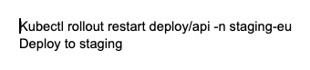 | 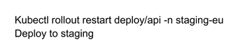 |

### edit-footnote-text

Both retain the superscript marker and the unchanged “Finance sheet v7, pulled 28 Aug.” footnote at the page bottom.

[Full browser page](shots-benchmark/20260904-final/micro/edit-footnote-text/browser-page.png) · [Viewport captures](shots-benchmark/20260904-final/micro/edit-footnote-text/browser/capture.json) · [PDF](shots-benchmark/20260904-final/micro/edit-footnote-text/export.pdf)

| Browser | PDF |
|---|---|
| 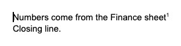 | 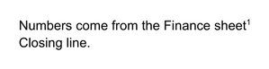 |

| Browser footnote, second view | PDF footnote, same page |
|---|---|
| 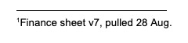 | 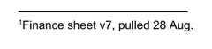 |

### edit-list-marker-restyles

Both show a numbered “Priority: Migrate the queue” paragraph followed by the unnumbered next line. Indentation and line breaks agree.

[Full browser page](shots-benchmark/20260904-final/micro/edit-list-marker-restyles/browser-page.png) · [Viewport captures](shots-benchmark/20260904-final/micro/edit-list-marker-restyles/browser/capture.json) · [PDF](shots-benchmark/20260904-final/micro/edit-list-marker-restyles/export.pdf)

| Browser | PDF |
|---|---|
| 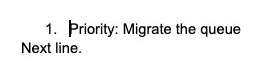 |  |

### edit-resets-alignment

Both show the signature left-aligned and retain the following paragraph. The old right alignment is absent in both.

[Full browser page](shots-benchmark/20260904-final/micro/edit-resets-alignment/browser-page.png) · [Viewport captures](shots-benchmark/20260904-final/micro/edit-resets-alignment/browser/capture.json) · [PDF](shots-benchmark/20260904-final/micro/edit-resets-alignment/export.pdf)

| Browser | PDF |
|---|---|
| 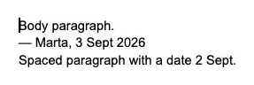 | 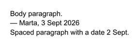 |

### edit-strips-sibling-bold

Both show the heading, effort sentence and status line with the same line breaks; neither restores the lost sibling formatting.

[Full browser page](shots-benchmark/20260904-final/micro/edit-strips-sibling-bold/browser-page.png) · [Viewport captures](shots-benchmark/20260904-final/micro/edit-strips-sibling-bold/browser/capture.json) · [PDF](shots-benchmark/20260904-final/micro/edit-strips-sibling-bold/export.pdf)

| Browser | PDF |
|---|---|
| 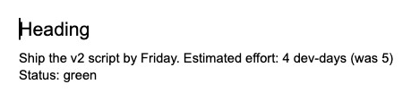 | 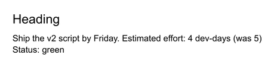 |

### write-tab-inherits-bullet

Both show a bullet on the title, body paragraphs and otherwise blank spacer paragraphs.

[Full browser page](shots-benchmark/20260904-final/micro/write-tab-inherits-bullet/browser-page.png) · [Viewport captures](shots-benchmark/20260904-final/micro/write-tab-inherits-bullet/browser/capture.json) · [PDF](shots-benchmark/20260904-final/micro/write-tab-inherits-bullet/export.pdf)

| Browser | PDF |
|---|---|
| 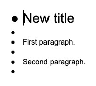 | 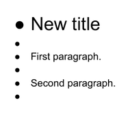 |

## Failure modes and limits

- **Late outline panel:** the tables copy initially failed twice because the outline appeared after the first canvas tile. The final script collapses it again after setup and waits for it to disappear; both final table captures passed.
- **Late toast:** initial micro screenshots included “Comments hidden” because the toast appeared after the dismissal check. The final script waits for that toast, dismisses it, and confirms it is hidden before capture. The original trial is retained separately.
- **Menu names:** Google appends keyboard shortcuts and submenu arrows to labels, so an exact accessible-name match timed out during development. The script matches the visible menu item’s prefix. UI selectors and English labels remain maintenance dependencies.
- **Window geometry:** macOS clamped the requested 1440×1200 outer window to 1440×923 on this display. Playwright fixes the viewport at 1440×828. Legacy `shot.json` retains `gdt-shot`’s historical approximate window string for compatibility; measured geometry in `capture.json` is authoritative. Do not pixel-diff a new scripted capture against an old extension capture of unknown size.
- **Scrolling:** Chrome clamps offsets beyond the scrollable range. The last requested offset in a micro capture is 650 but its actual offset is 545. Explicit `--views` retains duplicates; automatic coverage stops when the bottom is visible. This prevents endless or repeated bottom captures.
- **Authentication and access:** Google login was performed by the human in the dedicated profile. A restarted browser reused that login. The script refuses a CDP endpoint belonging to another profile and times out visibly when the editor/account cannot be verified. No headless Google login was attempted.
- **Rendering:** the paint wait, font readiness and animation frames worked for all final captures. They do not prove readiness on every network or future Docs version; inspect captures when diagnosing a rendering failure. Long-lived collaboration connections make `networkidle` unsuitable as a finish signal.
- **Concurrency and cursors:** run one capture at a time. Opening the same Doc in another tab produced a collaborator label in an initial trial; the duplicate dedicated tab was closed before the measured runs. A blinking local caret remains part of the editor view.

Validation: seven local tests passed for scrolling, complete bottom coverage, clamped explicit counts, legacy filing, foreign-profile refusal, existing-output protection and invalid arguments. Ruff passed for all added Python scripts. All 11 documents’ `modified` timestamps matched before and after the final benchmark. The runner made only metadata/export reads and browser view changes; it contains no document edit or sharing operation.
